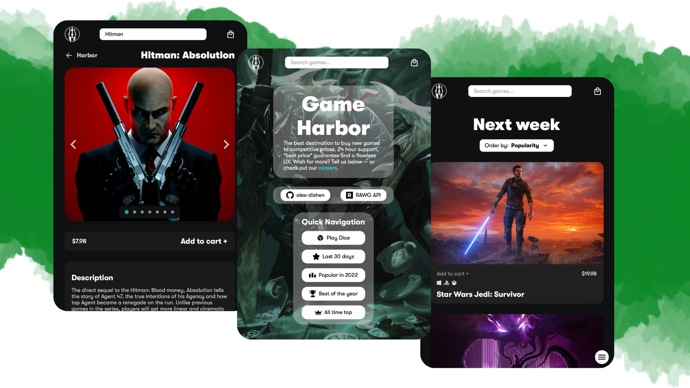
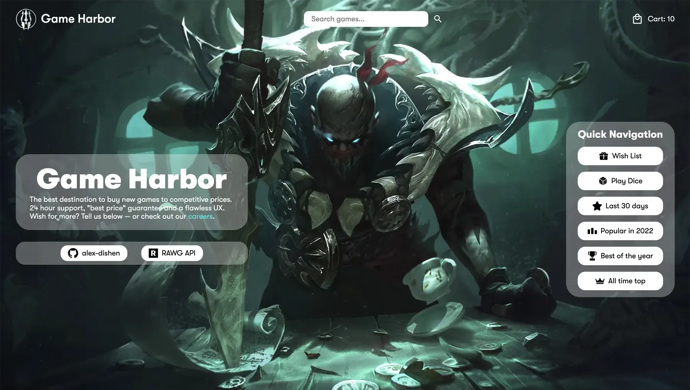

<h1 align='center'>Game Harbor</h1>



<p align='center'>Shopping Cart for <a href="https://www.theodinproject.com/paths/full-stack-javascript/courses/javascript">The Odin Project</a></p>


## Demo

🔥 [Live Demo](https://alex-dishen.github.io/game-harbor/)

## Built with

- React
- Redux ToolKit
- TypeScript
- Styled-Components
- RAWG API

## Features

- Extensive catalog of games thanks to the [RAWG API](https://rawg.io/apidocs).
- Search any game you want.
- Games information and screenshots.
- Responsive design.
- Filters to find exact genre or release period.
- Cart for games user wants to 'buy'

## Screenshots




## Development

Here are the steps to run the project locally.

1. Clone the repository.

```sh
HTTPS - $ git clone https://github.com/alex-dishen/shop.git
or
SSH - $ git clone git@github.com:alex-dishen/shop.git
```

2. Move to the cloned directory.

```sh
$ cd shop
```

3. Install the dependencies.

```sh
$ npm i
or
$ yarn
```

4. [Create a RAWG account](https://rawg.io/apidocs) to get your API key.

5. Create <code>.env</code> file in the root directory.

6. Add: <code>VITE_RAWG_API = YOUR API KEY</code>. (Remember to replace <code>YOUR API KEY</code> with generated key after creating and account)

7. Run the project.

```sh
$ npm start
or
$ yarn start
```

## **Navigation**
* See my previous project [Currency Converter](https://github.com/alex-dishen/currency-converter)
* See my next project [Swipi](https://github.com/midstem/swipi)